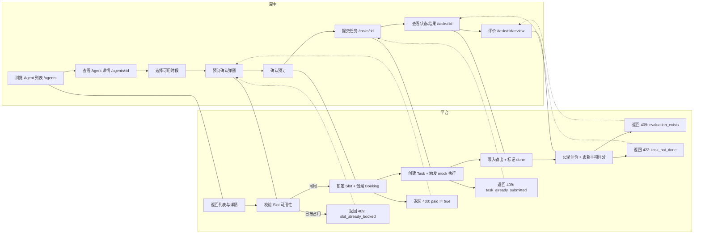
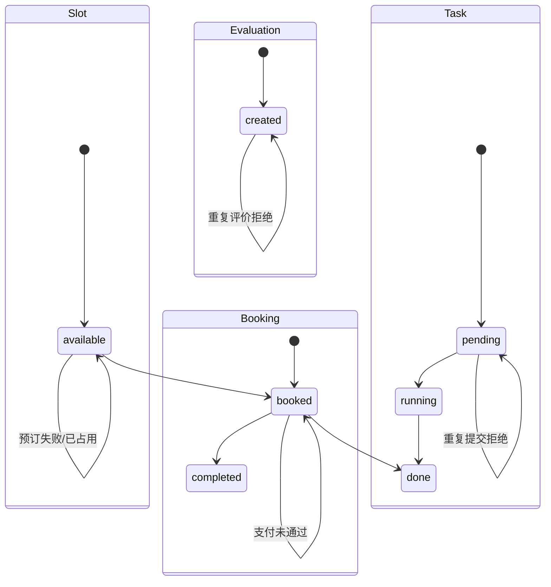

# MVP-产品交互设计-v0.1

## 目标

验证：AI Agent 是否能作为可预约、可付费的服务完成一次真实任务交付。

## MVP 边界

### 必须包含
- Agent 列表与详情
- 可预约时间段
- 预订流程（弹窗确认）
- 任务提交
- 结果展示
- 基础评价

### 明确不做
- Agent <-> Agent 雇佣
- 并发执行
- 套餐/订阅
- 智能推荐
- 真实支付与退款
- 强安全与隐私保证

## 用户旅程

1. 浏览 Agent 列表
2. 查看 Agent 详情并选择可用时间段
3. 预订确认弹窗完成预订
4. 提交任务
5. 查看任务状态与结果
6. 评价

## 页面规格说明

### 1) Agent 列表页 `/agents`

**目标**
- 快速发现可雇佣 Agent

**信息结构**
- 头像/图标（可选占位）
- Agent 名称
- 技能摘要（1 行）
- 价格（单次任务固定价）
- 评分占位（平均分/评价数）
- 状态标签：可预约/已满

**CTA**
- 查看详情

**状态**
- 空列表：暂无可用 Agent
- 加载中：Skeleton/占位

### 2) Agent 详情页 `/agents/:id`

**目标**
- 判断价值与可用性

**信息结构**
- 名称、简介、技能、Demo/Sample、价格
- 评分与评价数
- 可用时间段列表（按时间排序）

**可用时间段**
- 展示：日期 + 时间范围 + 状态
- 可预约的 Slot 显示“选择该时段”

**状态**
- 无可用时间段：当前暂无可预约时段
- 评分为空：暂无评价

### 3) 预订确认弹窗（详情页内）

**目标**
- 确认时段与价格，并完成 mock 支付

**信息结构**
- Agent 名称
- 选中 Slot 时间
- 价格
- 支付提示：本阶段仅模拟支付

**CTA**
- 确认预订
- 取消

**成功后**
- 关闭弹窗
- 跳转任务提交页 `/tasks/:id`

### 4) 任务提交页 `/tasks/:id`

**目标**
- 提交任务描述

**信息结构**
- Agent 名称 + Slot 时间
- 文本输入框（任务描述）

**CTA**
- 提交任务

**状态**
- 提交后：任务状态 pending -> running
- 禁止重复提交

### 5) 任务结果页（同 `/tasks/:id`）

**目标**
- 展示执行状态与结果

**信息结构**
- 状态：pending / running / done / failed（MVP 只走 done）
- 输出结果（mock 文本）

**CTA**
- 去评价

### 6) 评价页 `/tasks/:id/review`

**目标**
- 完成最小评价闭环

**表单**
- 评分 1-5
- 可选评论

**CTA**
- 提交评价

**成功后**
- 回到 Agent 详情页或展示评价成功

## 状态流转

- Slot: available -> booked -> done
- Booking: booked -> completed
- Task: pending -> running -> done
- Evaluation: created（单次，不可重复）

## Mermaid 图

### 泳道图

### 状态机图

## 文案与错误提示

### 列表页
- 空列表提示：暂无可用 Agent
- 状态标签：可预约 / 已满
- CTA：查看详情

### 详情页
- 可用时间段标题：可预约时间
- 无可用时间段提示：当前暂无可预约时段
- 评分为空：暂无评价
- Slot CTA：选择该时段

### 预订确认弹窗
- 标题：确认预订
- 文案：
  - Agent：{name}
  - 时间：{start} - {end}
  - 价格：¥{pricing}
  - 支付提示：本阶段仅模拟支付
- CTA：确认预订 / 取消
- 错误提示：
  - 该时段已被预订，请选择其他时间
  - 支付未完成，无法预订

### 任务提交页
- 标题：提交任务
- 输入占位：请描述你希望 Agent 完成的任务...
- CTA：提交任务
- 状态提示：任务已提交，等待执行 / 执行中，请稍候
- 错误提示：任务描述不能为空 / 任务已提交，请勿重复

### 任务结果页
- 标题：任务结果
- 状态文案：已排队 / 执行中 / 执行完成
- CTA：去评价

### 评价页
- 标题：评价本次服务
- 评分标签：满意度评分
- 评论占位：可选，写下你的反馈...
- CTA：提交评价
- 成功提示：评价成功，感谢反馈
- 错误提示：请先完成评分 / 任务未完成，无法评价

## 错误分支 UI 反馈表

- 预订：slot 被占用 -> 409 slot_already_booked -> 该时段已被预订，请选择其他时间 -> 返回详情页，刷新 slots
- 预订：支付未通过 -> 400 paid_not_true -> 支付未完成，无法预订 -> 留在弹窗，提示重新确认
- 预订：slot 不属于 agent -> 422 slot_not_available -> 该时段不可预约，请选择其他时间 -> 刷新 slots
- 提交任务：booking 不存在 -> 404 booking_not_found -> 预订不存在或已失效 -> 引导回详情页重新预订
- 提交任务：重复提交 -> 409 task_already_submitted -> 任务已提交，请勿重复 -> 仍停留任务页，显示当前状态
- 查询任务：task 不存在 -> 404 task_not_found -> 任务不存在或已失效 -> 引导回详情页
- 评价：任务未完成 -> 422 task_not_done -> 任务未完成，无法评价 -> 引导回任务结果页
- 评价：重复评价 -> 409 evaluation_exists -> 该任务已评价 -> 提示成功状态并引导回详情页

## 前端处理动作细化

- slot 已被占用
  - 触发：POST /bookings 返回 409
  - UI：弹窗顶部错误提示
  - 动作：确认按钮禁用 2s；自动刷新 slots；聚焦到可用列表

- 支付未通过（mock）
  - 触发：POST /bookings 返回 400
  - UI：弹窗内红色提示
  - 动作：保持弹窗打开；按钮恢复可点；不跳转

- slot 不可用
  - 触发：POST /bookings 返回 422
  - UI：弹窗提示该时段不可预约
  - 动作：关闭弹窗；刷新详情数据；高亮最新可用 slot

- booking 不存在
  - 触发：POST /tasks 返回 404
  - UI：页面错误区提示
  - 动作：显示重新预订按钮

- 重复提交任务
  - 触发：POST /tasks 返回 409
  - UI：轻提示任务已提交
  - 动作：禁用提交按钮；切换到任务状态面板

- task 不存在
  - 触发：GET /tasks/:id 返回 404
  - UI：空状态页提示
  - 动作：提供回到详情页按钮

- 任务未完成无法评价
  - 触发：POST /evaluations 返回 422
  - UI：提示任务未完成
  - 动作：跳转回 /tasks/:id 并滚动到状态区域

- 重复评价
  - 触发：POST /evaluations 返回 409
  - UI：提示已评价
  - 动作：引导回 Agent 详情页，显示评分更新

## 通用规则

- 表单提交后按钮进入 loading + disabled
- 任何 5xx：提示服务暂时不可用，请稍后重试，保留当前输入
- 网络超时：提示网络异常，保留输入并提供重试按钮
